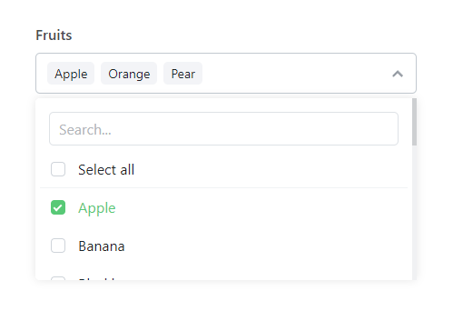

# Silverstripe Frontend Multi Select Field

With the move to React components in Silverstripe 4 and 5, it gets harder to load admin components into the frontend of your site.

This module adds `ListBox` style functionality to frontend forms using a wrapper around a basic select(`DropdownField`) elements that adds functionality and styling from the multi-select-dropdown by [codeshackio](https://github.com/codeshackio/multi-select-dropdown-js). More info on this project can be found here: https://codeshack.io/multi-select-dropdown-html-javascript/



## Installation

Install this module via composer:

    compose require dft/silverstripe-frontend-multiselectfield

## Adding to a form

Just add this field to your frontend form like you would any other field, for example:

```php

$form = Form::create(
    FieldList::create(
        FrontendMultiSelectField::create(
            'Fruit',
            'Fruit',
            Fruit::get()
                ->map('ID', 'Title')
                ->toArray()
        )
    ),
    FieldList::create(
        FormAction::create(
            'doMyAction',
            'Submit Form'
        )
    )
);
```

## Configuring

This field supports some configuration out of the box:

`require_client` (default `true`): By default, this field injects some javascript and CSS into your site to style this field. If you want to add this JS and CSS to your own theme's bundle, you can disable this feature by using Silverstripe's global config:

```yml
DFT\SilverStripe\FrontendMultiSelectField\FrontendMultiSelectField:
    require_client: false
```

`search` (default `true`): By default this field loads a search form to filter possible values. You can disable the search form by setting `setSearch` to false (this can be done on a field by field bases) when you load the field:

```php
FrontendMultiSelectField::create(
    'Fruit',
    'Fruit',
    Fruit::get()
        ->map('ID', 'Title')
        ->toArray()
)->setSearch(false);
```

`select_all` (default `true`): By default this field adds a "select all" button. You can disable this by setting `setSelectAll` to false (this can be done on a field by field bases) when you load the field:

```php
FrontendMultiSelectField::create(
    'Fruit',
    'Fruit',
    Fruit::get()
        ->map('ID', 'Title')
        ->toArray()
)->setSelectAll(false);
```

`limit` (default 0): Limit allows you to limit the number of items that can be selected. By default this is disabled (set to 0), if you want to limit the number of items, you can use:

```php
FrontendMultiSelectField::create(
    'Fruit',
    'Fruit',
    Fruit::get()
        ->map('ID', 'Title')
        ->toArray()
)->limit(5); // Limits to a maximum of 5 items
```